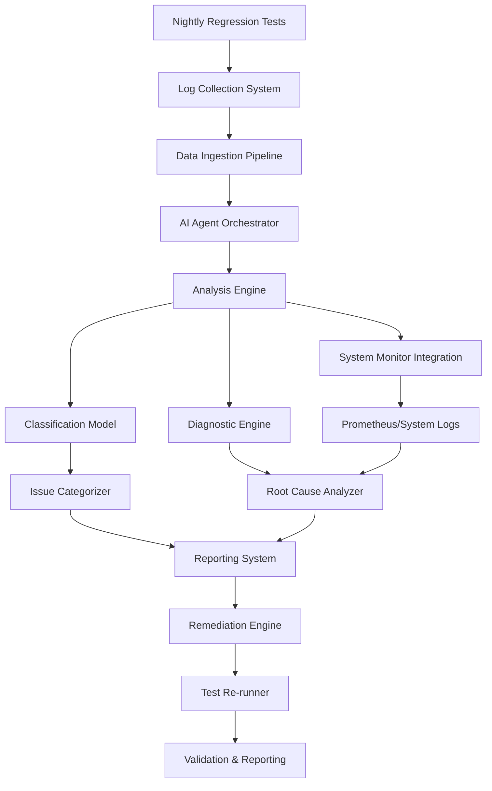

# AI Agent for Automated Regression Test Failure Analysis

## Executive Summary

This comprehensive guide outlines the development of an **Intelligent Regression Test Analysis Agent** that can:
- Analyze nightly regression test logs automatically
- Distinguish between product bugs, infrastructure issues, and test setup problems
- Provide precise diagnostics with actionable recommendations
- Eventually auto-remediate and re-run failed tests

---

## Table of Contents

1. [System Architecture Overview](#system-architecture-overview)
2. [Data Preparation Strategy](#data-preparation-strategy)
3. [AI Training Methodology](#ai-training-methodology)
4. [Agent Development Framework](#agent-development-framework)
5. [Workflow Orchestration](#workflow-orchestration)
6. [Implementation Roadmap](#implementation-roadmap)

---

## System Architecture Overview

### High-Level Architecture



### Component Breakdown

#### 1. **Log Collection System**
- **Purpose**: Centralized collection of all test artifacts
- **Components**:
  - Test execution logs
  - Screenshot captures
  - System logs (Windows Event Logs, Application logs)
  - Performance metrics (Prometheus data)
  - Network logs
  - VM state snapshots

#### 2. **Data Ingestion Pipeline**
- **Purpose**: Normalize and structure heterogeneous log data
- **Technologies**: Apache Kafka / RabbitMQ for streaming, MinIO/S3 for storage
- **Processing**: ETL pipeline to convert raw logs to structured format

#### 3. **AI Agent Orchestrator**
- **Purpose**: Main control center coordinating all AI operations
- **Framework**: LangGraph or Microsoft Autogen
- **Responsibilities**:
  - Task routing
  - Multi-agent coordination
  - State management
  - Decision tree execution

#### 4. **Analysis Engine**
- **Purpose**: Core intelligence for failure analysis
- **Sub-components**:
  - **Classification Model**: Categorizes failures (product/infra/setup)
  - **Diagnostic Engine**: Deep-dive analysis for root cause
  - **System Monitor Integration**: Correlates with system metrics

---

## Data Preparation Strategy

### Phase 1: Historical Data Collection (Weeks 1-2)

#### Step 1: Inventory All Data Sources

Create a comprehensive list of ALL data sources:

**Test Logs:**
```
- Test execution logs (.log, .txt)
- Test framework output (JUnit XML, TestNG, etc.)
- Application logs generated during tests
- Error stack traces
- Console output
```

**System Logs:**
```
- Windows Event Logs (System, Application, Security)
- IIS logs (if applicable)
- Database logs
- Service logs
```

**Infrastructure Data:**
```
- VM performance metrics (CPU, Memory, Disk, Network)
- Prometheus metrics
- Network packet captures
- Firewall logs
- RDP connection logs
```

**Visual Evidence:**
```
- Screenshots (both successful and failed)
- Screen recordings (if available)
- UI automation logs
```

**Test Artifacts:**
```
- Golden reference files
- Test data files
- Configuration files
- Workspace snapshots
```

#### Step 2: Establish Data Collection Infrastructure

**A. Centralized Log Storage**

Create a structured directory hierarchy:

```
/regression_data/
├── raw_logs/
│   ├── YYYY-MM-DD/
│   │   ├── test_logs/
│   │   │   ├── test_suite_1/
│   │   │   │   ├── execution.log
│   │   │   │   ├── error.log
│   │   │   │   └── metadata.json
│   │   ├── system_logs/
│   │   │   ├── vm_01/
│   │   │   │   ├── windows_event.evtx
│   │   │   │   ├── app_logs/
│   │   │   │   └── performance.csv
│   │   ├── screenshots/
│   │   │   ├── test_name_timestamp.png
│   │   ├── prometheus/
│   │   │   └── metrics_export.json
│   │   └── network/
│   │       └── firewall_logs.txt
├── processed/
│   ├── YYYY-MM-DD/
│   │   ├── structured_logs.jsonl
│   │   ├── failure_analysis.json
│   │   └── embeddings/
├── training_data/
│   ├── labeled_failures/
│   │   ├── product_issues/
│   │   ├── infra_issues/
│   │   └── test_setup_issues/
│   └── golden_examples/
└── metadata/
    ├── schema_definitions/
    └── data_catalog.json
```

**B. Automated Collection Scripts**

Create PowerShell scripts to automatically gather data:

```powershell
# collect_regression_data.ps1
param(
    [string]$TestRunId,
    [string]$OutputBase = "E:\RegressionData\raw_logs"
)

$date = Get-Date -Format "yyyy-MM-dd"
$runPath = Join-Path $OutputBase "$date\$TestRunId"

# Create directory structure
New-Item -ItemType Directory -Force -Path "$runPath\test_logs"
New-Item -ItemType Directory -Force -Path "$runPath\system_logs"
New-Item -ItemType Directory -Force -Path "$runPath\screenshots"
New-Item -ItemType Directory -Force -Path "$runPath\prometheus"
New-Item -ItemType Directory -Force -Path "$runPath\network"

# Collect test logs
Copy-Item -Path "C:\TestResults\*" -Destination "$runPath\test_logs\" -Recurse

# Export Windows Event Logs
$vms = @("VM01", "VM02", "VM03")
foreach ($vm in $vms) {
    $vmPath = "$runPath\system_logs\$vm"
    New-Item -ItemType Directory -Force -Path $vmPath
    
    # Export event logs from remote VM
    Invoke-Command -ComputerName $vm -ScriptBlock {
        wevtutil epl System "C:\Temp\system.evtx"
        wevtutil epl Application "C:\Temp\application.evtx"
    }
    
    Copy-Item -Path "\\$vm\C$\Temp\*.evtx" -Destination $vmPath
}

# Export Prometheus metrics
$prometheusUrl = "http://prometheus:9090/api/v1/query_range"
$metricsToExport = @(
    "node_cpu_seconds_total",
    "node_memory_MemAvailable_bytes",
    "node_disk_io_time_seconds_total",
    "node_network_receive_bytes_total"
)

foreach ($metric in $metricsToExport) {
    $params = @{
        query = $metric
        start = (Get-Date).AddHours(-1).ToString("o")
        end = (Get-Date).ToString("o")
        step = "15s"
    }
    
    $result = Invoke-RestMethod -Uri $prometheusUrl -Method Get -Body $params
    $result | ConvertTo-Json -Depth 10 | Out-File "$runPath\prometheus\$metric.json"
}

# Collect screenshots
Copy-Item -Path "C:\TestScreenshots\*" -Destination "$runPath\screenshots\" -Recurse

# Create metadata file
$metadata = @{
    test_run_id = $TestRunId
    timestamp = Get-Date -Format "o"
    collection_complete = $true
    data_sources = @{
        test_logs = (Get-ChildItem "$runPath\test_logs" -Recurse).Count
        system_logs = (Get-ChildItem "$runPath\system_logs" -Recurse).Count
        screenshots = (Get-ChildItem "$runPath\screenshots").Count
    }
} | ConvertTo-Json

$metadata | Out-File "$runPath\metadata.json"

Write-Host "Data collection complete: $runPath"
```

#### Step 3: Data Annotation and Labeling

**Manual Labeling Process (First 3-6 Months)**

Create a labeling tool or use Label Studio:

**A. Define Failure Categories**

```json
{
  "failure_categories": {
    "product_bug": {
      "subcategories": [
        "ui_rendering_issue",
        "functionality_broken",
        "crash",
        "performance_degradation",
        "data_corruption",
        "integration_failure"
      ]
    },
    "infrastructure_issue": {
      "subcategories": [
        "vm_resource_exhaustion",
        "network_connectivity",
        "firewall_blocking",
        "rdp_session_interference",
        "kvm_keystroke_loss",
        "service_unavailable",
        "disk_space_full",
        "permission_denied"
      ]
    },
    "test_setup_issue": {
      "subcategories": [
        "workspace_misconfiguration",
        "golden_file_outdated",
        "missing_dependencies",
        "environment_variable_incorrect",
        "test_data_invalid",
        "precondition_not_met"
      ]
    }
  }
}
```

**B. Create Labeling Template**

For each failure, document:

```json
{
  "test_id": "TEST_001",
  "test_name": "LoginFlowTest",
  "failure_timestamp": "2026-01-29T03:45:12Z",
  "primary_category": "infrastructure_issue",
  "subcategory": "rdp_session_interference",
  "root_cause": "User RDP session left desktop in non-standard state",
  "symptoms": [
    "Blank screenshots captured",
    "UI automation unable to find elements",
    "Test timed out after 5 minutes"
  ],
  "evidence": {
    "log_excerpts": [
      "ERROR: Unable to locate element with id='login_button'",
      "WARNING: Screenshot saved but appears blank"
    ],
    "system_metrics": {
      "rdp_sessions": 2,
      "active_users": ["testuser", "admin"]
    },
    "screenshots": ["login_page_blank.png"]
  },
  "resolution": {
    "action_taken": "Closed RDP sessions, reset desktop",
    "rerun_result": "PASSED",
    "fix_type": "manual_intervention"
  },
  "patterns": {
    "time_of_day": "night",
    "vm_id": "VM02",
    "frequency": "occurs_randomly",
    "related_tests": ["LoginFlowTest", "UserProfileTest"]
  }
}
```

**C. Daily Labeling Workflow**

```
1. Morning (30 mins):
   - Review overnight failures
   - Quick triage: obvious vs. needs investigation
   
2. Deep Analysis (2-3 hours):
   - For each failure:
     a. Read test log completely
     b. Check system logs at failure time
     c. Review Prometheus metrics
     d. Examine screenshots
     e. Check for similar past failures
     f. Identify root cause
     g. Document in labeling tool
     
3. Pattern Recognition (30 mins):
   - Look for common patterns across failures
   - Update pattern database
   - Refine categories if needed
```

### Phase 2: Data Cleaning and Normalization (Weeks 3-4)

#### Step 1: Log Parsing and Structuring

**A. Create Log Parsers**

Different logs need different parsers:

```python
# log_parser.py
import re
import json
from datetime import datetime
from typing import Dict, List, Any

class TestLogParser:
    """Parse test execution logs"""
    
    def __init__(self):
        self.patterns = {
            'test_start': r'\[(\d{4}-\d{2}-\d{2} \d{2}:\d{2}:\d{2})\] START: (.+)',
            'test_end': r'\[(\d{4}-\d{2}-\d{2} \d{2}:\d{2}:\d{2})\] (PASS|FAIL): (.+)',
            'error': r'\[(\d{4}-\d{2}-\d{2} \d{2}:\d{2}:\d{2})\] ERROR: (.+)',
            'warning': r'\[(\d{4}-\d{2}-\d{2} \d{2}:\d{2}:\d{2})\] WARNING: (.+)',
            'exception': r'Exception: (.+)\n\s+at (.+)',
        }
    
    def parse_log_file(self, filepath: str) -> Dict[str, Any]:
        """Parse a single log file into structured format"""
        
        with open(filepath, 'r', encoding='utf-8', errors='ignore') as f:
            content = f.read()
        
        structured = {
            'file_path': filepath,
            'test_name': self._extract_test_name(filepath),
            'events': [],
            'errors': [],
            'warnings': [],
            'exceptions': [],
            'summary': {}
        }
        
        # Extract all events chronologically
        for line in content.split('\n'):
            for event_type, pattern in self.patterns.items():
                match = re.search(pattern, line)
                if match:
                    event = {
                        'type': event_type,
                        'timestamp': match.group(1) if len(match.groups()) > 0 else None,
                        'content': match.groups()[-1],
                        'raw_line': line
                    }
                    structured['events'].append(event)
                    
                    if event_type == 'error':
                        structured['errors'].append(event)
                    elif event_type == 'warning':
                        structured['warnings'].append(event)
                    elif event_type == 'exception':
                        structured['exceptions'].append(event)
        
        # Extract summary information
        structured['summary'] = self._extract_summary(structured['events'])
        
        return structured
    
    def _extract_test_name(self, filepath: str) -> str:
        """Extract test name from file path"""
        # Implement based on your naming convention
        return filepath.split('\\')[-2]
    
    def _extract_summary(self, events: List[Dict]) -> Dict:
        """Summarize test execution"""
        summary = {
            'start_time': None,
            'end_time': None,
            'duration_seconds': 0,
            'result': 'UNKNOWN',
            'error_count': 0,
            'warning_count': 0
        }
        
        for event in events:
            if event['type'] == 'test_start':
                summary['start_time'] = event['timestamp']
            elif event['type'] == 'test_end':
                summary['end_time'] = event['timestamp']
                summary['result'] = event['content'].split(':')[0]
        
        if summary['start_time'] and summary['end_time']:
            start = datetime.strptime(summary['start_time'], '%Y-%m-%d %H:%M:%S')
            end = datetime.strptime(summary['end_time'], '%Y-%m-%d %H:%M:%S')
            summary['duration_seconds'] = (end - start).total_seconds()
        
        summary['error_count'] = len([e for e in events if e['type'] == 'error'])
        summary['warning_count'] = len([e for e in events if e['type'] == 'warning'])
        
        return summary


class SystemLogParser:
    """Parse Windows Event Logs (exported as XML or EVTX)"""
    
    def parse_event_log(self, filepath: str) -> List[Dict]:
        """Parse Windows Event Log"""
        import xml.etree.ElementTree as ET
        
        events = []
        
        # If EVTX, convert to XML first
        if filepath.endswith('.evtx'):
            self._convert_evtx_to_xml(filepath)
            filepath = filepath.replace('.evtx', '.xml')
        
        tree = ET.parse(filepath)
        root = tree.getroot()
        
        for event in root.findall('.//{http://schemas.microsoft.com/win/2004/08/events/event}Event'):
            structured_event = {
                'event_id': event.find('.//{http://schemas.microsoft.com/win/2004/08/events/event}EventID').text,
                'level': event.find('.//{http://schemas.microsoft.com/win/2004/08/events/event}Level').text,
                'timestamp': event.find('.//{http://schemas.microsoft.com/win/2004/08/events/event}TimeCreated').get('SystemTime'),
                'source': event.find('.//{http://schemas.microsoft.com/win/2004/08/events/event}Provider').get('Name'),
                'message': self._extract_message(event),
                'computer': event.find('.//{http://schemas.microsoft.com/win/2004/08/events/event}Computer').text
            }
            events.append(structured_event)
        
        return events
    
    def _convert_evtx_to_xml(self, evtx_path: str):
        """Convert EVTX to XML using PowerShell"""
        import subprocess
        xml_path = evtx_path.replace('.evtx', '.xml')
        
        ps_script = f"""
        Get-WinEvent -Path '{evtx_path}' | Export-CliXml -Path '{xml_path}'
        """
        
        subprocess.run(['powershell', '-Command', ps_script], capture_output=True)
    
    def _extract_message(self, event_node) -> str:
        """Extract message from event XML"""
        msg_node = event_node.find('.//{http://schemas.microsoft.com/win/2004/08/events/event}EventData')
        if msg_node is not None:
            return ' '.join([data.text for data in msg_node.findall('.//Data') if data.text])
        return ""


class PrometheusParser:
    """Parse Prometheus metrics exports"""
    
    def parse_metrics(self, filepath: str) -> Dict[str, Any]:
        """Parse Prometheus JSON export"""
        
        with open(filepath, 'r') as f:
            data = json.load(f)
        
        structured = {
            'metric_name': data.get('data', {}).get('result', [{}])[0].get('metric', {}).get('__name__', ''),
            'values': [],
            'stats': {}
        }
        
        # Extract time series data
        for result in data.get('data', {}).get('result', []):
            metric_labels = result.get('metric', {})
            values = result.get('values', [])
            
            for timestamp, value in values:
                structured['values'].append({
                    'timestamp': datetime.fromtimestamp(timestamp).isoformat(),
                    'value': float(value),
                    'labels': metric_labels
                })
        
        # Calculate statistics
        if structured['values']:
            values_only = [v['value'] for v in structured['values']]
            structured['stats'] = {
                'min': min(values_only),
                'max': max(values_only),
                'avg': sum(values_only) / len(values_only),
                'count': len(values_only)
            }
        
        return structured
```

**B. Create Unified Data Structure**

Convert all parsed data into a unified JSONL format:

```python
# data_unifier.py
import json
from pathlib import Path
from datetime import datetime
from typing import Dict, List

class DataUnifier:
    """Unify all data sources into single structured format"""
    
    def __init__(self, raw_data_dir: str, output_dir: str):
        self.raw_data_dir = Path(raw_data_dir)
        self.output_dir = Path(output_dir)
        self.test_log_parser = TestLogParser()
        self.system_log_parser = SystemLogParser()
        self.prometheus_parser = PrometheusParser()
    
    def process_test_run(self, run_date: str, run_id: str):
        """Process all data for a single test run"""
        
        run_path = self.raw_data_dir / run_date / run_id
        output_path = self.output_dir / run_date / run_id
        output_path.mkdir(parents=True, exist_ok=True)
        
        unified_data = {
            'run_id': run_id,
            'run_date': run_date,
            'tests': [],
            'system_events': [],
            'metrics': [],
            'screenshots': []
        }
        
        # Process test logs
        test_logs_dir = run_path / 'test_logs'
        if test_logs_dir.exists():
            for test_dir in test_logs_dir.iterdir():
                if test_dir.is_dir():
                    test_data = self._process_test(test_dir)
                    unified_data['tests'].append(test_data)
        
        # Process system logs
        system_logs_dir = run_path / 'system_logs'
        if system_logs_dir.exists():
            for vm_dir in system_logs_dir.iterdir():
                if vm_dir.is_dir():
                    vm_events = self._process_vm_logs(vm_dir)
                    unified_data['system_events'].extend(vm_events)
        
        # Process Prometheus metrics
        prometheus_dir = run_path / 'prometheus'
        if prometheus_dir.exists():
            for metric_file in prometheus_dir.glob('*.json'):
                metric_data = self.prometheus_parser.parse_metrics(str(metric_file))
                unified_data['metrics'].append(metric_data)
        
        # Index screenshots
        screenshots_dir = run_path / 'screenshots'
        if screenshots_dir.exists():
            for screenshot in screenshots_dir.glob('*.png'):
                unified_data['screenshots'].append({
                    'filename': screenshot.name,
                    'path': str(screenshot),
                    'timestamp': self._extract_timestamp_from_filename(screenshot.name),
                    'test_name': self._extract_test_from_screenshot(screenshot.name)
                })
        
        # Write unified data
        output_file = output_path / 'unified_data.json'
        with open(output_file, 'w') as f:
            json.dump(unified_data, f, indent=2)
        
        # Also write as JSONL for easier processing
        jsonl_file = output_path / 'unified_data.jsonl'
        with open(jsonl_file, 'w') as f:
            for test in unified_data['tests']:
                f.write(json.dumps(test) + '\n')
        
        print(f"Unified data written to {output_file}")
        
        return unified_data
    
    def _process_test(self, test_dir: Path) -> Dict:
        """Process a single test's data"""
        
        test_data = {
            'test_name': test_dir.name,
            'logs': {},
            'metadata': {}
        }
        
        # Parse execution log
        exec_log = test_dir / 'execution.log'
        if exec_log.exists():
            test_data['logs']['execution'] = self.test_log_parser.parse_log_file(str(exec_log))
        
        # Parse error log
        error_log = test_dir / 'error.log'
        if error_log.exists():
            test_data['logs']['error'] = self.test_log_parser.parse_log_file(str(error_log))
        
        # Load metadata
        metadata_file = test_dir / 'metadata.json'
        if metadata_file.exists():
            with open(metadata_file) as f:
                test_data['metadata'] = json.load(f)
        
        return test_data
    
    def _process_vm_logs(self, vm_dir: Path) -> List[Dict]:
        """Process logs from a single VM"""
        
        events = []
        vm_name = vm_dir.name
        
        # Process event logs
        for evtx_file in vm_dir.glob('*.evtx'):
            vm_events = self.system_log_parser.parse_event_log(str(evtx_file))
            for event in vm_events:
                event['vm'] = vm_name
                events.append(event)
        
        return events
    
    def _extract_timestamp_from_filename(self, filename: str) -> str:
        """Extract timestamp from screenshot filename"""
        # Implement based on your naming convention
        import re
        match = re.search(r'(\d{14})', filename)  # Assuming YYYYMMDDHHmmss format
        if match:
            ts = match.group(1)
            return datetime.strptime(ts, '%Y%m%d%H%M%S').isoformat()
        return ""
    
    def _extract_test_from_screenshot(self, filename: str) -> str:
        """Extract test name from screenshot filename"""
        # Implement based on your naming convention
        return filename.split('_')[0]
```

#### Step 2: Text Preprocessing

**A. Clean and Normalize Text**

```python
# text_preprocessor.py
import re
from typing import List, Dict

class TextPreprocessor:
    """Clean and normalize log text for AI training"""
    
    def __init__(self):
        # Patterns to normalize
        self.normalization_patterns = {
            # Normalize timestamps
            'timestamp': (r'\d{4}-\d{2}-\d{2}[T ]\d{2}:\d{2}:\d{2}(\.\d+)?', '<TIMESTAMP>'),
            # Normalize file paths
            'windows_path': (r'[A-Z]:\\(?:[^\\/:*?"<>|\r\n]+\\)*[^\\/:*?"<>|\r\n]*', '<FILEPATH>'),
            # Normalize IP addresses
            'ip_address': (r'\b\d{1,3}\.\d{1,3}\.\d{1,3}\.\d{1,3}\b', '<IPADDR>'),
            # Normalize UUIDs/GUIDs
            'uuid': (r'[0-9a-f]{8}-[0-9a-f]{4}-[0-9a-f]{4}-[0-9a-f]{4}-[0-9a-f]{12}', '<UUID>'),
            # Normalize memory addresses
            'memory_addr': (r'0x[0-9a-fA-F]+', '<MEMADDR>'),
            # Normalize numbers (but keep error codes)
            'large_number': (r'\b\d{5,}\b', '<NUMBER>'),
        }
        
        self.stopwords = set(['the', 'a', 'an', 'and', 'or', 'but', 'in', 'on', 'at', 'to', 'for'])
    
    def preprocess(self, text: str, normalize: bool = True) -> str:
        """Preprocess log text"""
        
        # Remove null bytes
        text = text.replace('\x00', '')
        
        # Normalize line endings
        text = text.replace('\r\n', '\n')
        
        # Apply normalization patterns if requested
        if normalize:
            for pattern_name, (pattern, replacement) in self.normalization_patterns.items():
                text = re.sub(pattern, replacement, text)
        
        return text
    
    def extract_key_phrases(self, text: str) -> List[str]:
        """Extract important phrases from log text"""
        
        # Error patterns
        error_patterns = [
            r'error:?\s+(.+?)(?:\n|$)',
            r'exception:?\s+(.+?)(?:\n|$)',
            r'failed:?\s+(.+?)(?:\n|$)',
            r'unable to\s+(.+?)(?:\n|$)',
            r'could not\s+(.+?)(?:\n|$)',
        ]
        
        key_phrases = []
        
        for pattern in error_patterns:
            matches = re.finditer(pattern, text, re.IGNORECASE)
            for match in matches:
                phrase = match.group(1).strip()
                if len(phrase) > 10 and len(phrase) < 200:  # Reasonable length
                    key_phrases.append(phrase)
        
        return list(set(key_phrases))  # Remove duplicates
    
    def extract_stack_trace(self, text: str) -> Dict:
        """Extract and structure stack traces"""
        
        stack_trace_pattern = r'(?:Exception|Error).*?(?:\n\s+at\s+.+?)+'
        matches = re.finditer(stack_trace_pattern, text, re.MULTILINE | re.DOTALL)
        
        stack_traces = []
        
        for match in matches:
            trace_text = match.group(0)
            lines = trace_text.split('\n')
            
            exception_type = lines[0].split(':')[0].strip() if ':' in lines[0] else lines[0]
            exception_message = lines[0].split(':', 1)[1].strip() if ':' in lines[0] else ''
            
            frames = []
            for line in lines[1:]:
                if 'at ' in line:
                    frame = line.strip().replace('at ', '')
                    frames.append(frame)
            
            stack_traces.append({
                'exception_type': exception_type,
                'message': exception_message,
                'frames': frames,
                'raw': trace_text
            })
        
        return stack_traces
```

**B. Create Training Examples**

```python
# training_example_generator.py
import json
from typing import Dict, List
from pathlib import Path

class TrainingExampleGenerator:
    """Generate training examples from labeled data"""
    
    def __init__(self, unified_data_dir: str, labels_dir: str, output_dir: str):
        self.unified_data_dir = Path(unified_data_dir)
        self.labels_dir = Path(labels_dir)
        self.output_dir = Path(output_dir)
        self.preprocessor = TextPreprocessor()
    
    def generate_examples(self):
        """Generate training examples from labeled failures"""
        
        examples = []
        
        # Read all labeled failures
        for label_file in self.labels_dir.glob('**/*.json'):
            with open(label_file) as f:
                label_data = json.load(f)
            
            # Find corresponding unified data
            run_date = label_data.get('run_date')
            run_id = label_data.get('run_id')
            test_name = label_data.get('test_name')
            
            unified_file = self.unified_data_dir / run_date / run_id / 'unified_data.json'
            if not unified_file.exists():
                continue
            
            with open(unified_file) as f:
                unified_data = json.load(f)
            
            # Find the specific test
            test_data = None
            for test in unified_data['tests']:
                if test['test_name'] == test_name:
                    test_data = test
                    break
            
            if not test_data:
                continue
            
            # Create training example
            example = self._create_example(test_data, unified_data, label_data)
            examples.append(example)
        
        # Split into train/val/test sets
        import random
        random.shuffle(examples)
        
        train_size = int(0.8 * len(examples))
        val_size = int(0.1 * len(examples))
        
        train_examples = examples[:train_size]
        val_examples = examples[train_size:train_size + val_size]
        test_examples = examples[train_size + val_size:]
        
        # Write to files
        self._write_examples(train_examples, self.output_dir / 'train.jsonl')
        self._write_examples(val_examples, self.output_dir / 'val.jsonl')
        self._write_examples(test_examples, self.output_dir / 'test.jsonl')
        
        print(f"Generated {len(examples)} examples:")
        print(f"  Train: {len(train_examples)}")
        print(f"  Val: {len(val_examples)}")
        print(f"  Test: {len(test_examples)}")
    
    def _create_example(self, test_data: Dict, unified_data: Dict, label: Dict) -> Dict:
        """Create a single training example"""
        
        # Extract test logs
        exec_log = test_data.get('logs', {}).get('execution', {})
        error_log = test_data.get('logs', {}).get('error', {})
        
        # Get relevant system events (within test time window)
        test_start = exec_log.get('summary', {}).get('start_time')
        test_end = exec_log.get('summary', {}).get('end_time')
        
        relevant_system_events = self._filter_events_by_time(
            unified_data.get('system_events', []),
            test_start,
            test_end
        )
        
        # Get relevant metrics
        relevant_metrics = self._get_metrics_at_time(
            unified_data.get('metrics', []),
            test_start,
            test_end
        )
        
        # Construct input text
        input_parts = []
        
        # Test execution summary
        input_parts.append(f"Test: {test_data['test_name']}")
        input_parts.append(f"Result: {exec_log.get('summary', {}).get('result', 'UNKNOWN')}")
        input_parts.append(f"Duration: {exec_log.get('summary', {}).get('duration_seconds', 0)} seconds")
        
        # Error messages
        if error_log.get('errors'):
            input_parts.append("\nErrors:")
            for error in error_log['errors'][:5]:  # Limit to top 5
                input_parts.append(f"  - {error['content']}")
        
        # Warnings
        if exec_log.get('warnings'):
            input_parts.append("\nWarnings:")
            for warning in exec_log['warnings'][:3]:
                input_parts.append(f"  - {warning['content']}")
        
        # System events
        if relevant_system_events:
            input_parts.append("\nRelevant System Events:")
            for event in relevant_system_events[:5]:
                input_parts.append(f"  - [{event['level']}] {event['source']}: {event['message']}")
        
        # Metrics anomalies
        if relevant_metrics:
            input_parts.append("\nSystem Metrics:")
            for metric_name, stats in relevant_metrics.items():
                input_parts.append(f"  - {metric_name}: min={stats['min']:.2f}, max={stats['max']:.2f}, avg={stats['avg']:.2f}")
        
        input_text = '\n'.join(input_parts)
        
        # Preprocess
        input_text = self.preprocessor.preprocess(input_text, normalize=True)
        
        # Construct output (label)
        output = {
            'category': label['primary_category'],
            'subcategory': label['subcategory'],
            'root_cause': label['root_cause'],
            'resolution': label['resolution']['action_taken'],
            'fix_type': label['resolution']['fix_type']
        }
        
        return {
            'input': input_text,
            'output': output,
            'metadata': {
                'test_name': test_data['test_name'],
                'run_date': label.get('run_date'),
                'run_id': label.get('run_id')
            }
        }
    
    def _filter_events_by_time(self, events: List[Dict], start_time: str, end_time: str) -> List[Dict]:
        """Filter system events by time window"""
        if not start_time or not end_time:
            return []
        
        from datetime import datetime
        start = datetime.fromisoformat(start_time.replace('Z', '+00:00'))
        end = datetime.fromisoformat(end_time.replace('Z', '+00:00'))
        
        filtered = []
        for event in events:
            event_time = datetime.fromisoformat(event['timestamp'].replace('Z', '+00:00'))
            if start <= event_time <= end:
                filtered.append(event)
        
        return filtered
    
    def _get_metrics_at_time(self, metrics: List[Dict], start_time: str, end_time: str) -> Dict:
        """Get metric statistics within time window"""
        # Implementation similar to _filter_events_by_time
        # Returns aggregated stats for each metric
        return {}
    
    def _write_examples(self, examples: List[Dict], output_file: Path):
        """Write examples to JSONL file"""
        output_file.parent.mkdir(parents=True, exist_ok=True)
        
        with open(output_file, 'w') as f:
            for example in examples:
                f.write(json.dumps(example) + '\n')
```

### Phase 3: Feature Engineering (Weeks 5-6)

#### Extract Domain-Specific Features

```python
# feature_extractor.py
from typing import Dict, List
import re

class FeatureExtractor:
    """Extract features for ML model training"""
    
    def extract_features(self, example: Dict) -> Dict:
        """Extract all features from an example"""
        
        input_text = example['input']
        
        features = {}
        
        # Text-based features
        features['text_length'] = len(input_text)
        features['line_count'] = input_text.count('\n')
        features['word_count'] = len(input_text.split())
        
        # Error indicators
        features['error_count'] = input_text.lower().count('error')
        features['exception_count'] = input_text.lower().count('exception')
        features['warning_count'] = input_text.lower().count('warning')
        features['fail_count'] = input_text.lower().count('fail')
        
        # Infrastructure keywords
        infra_keywords = ['timeout', 'connection', 'network', 'rdp', 'firewall', 'blocked', 
                         'permission', 'denied', 'disk', 'memory', 'cpu']
        features['infra_keyword_count'] = sum(input_text.lower().count(kw) for kw in infra_keywords)
        
        # Product keywords
        product_keywords = ['crash', 'assertion', 'null pointer', 'segmentation fault',
                           'ui rendering', 'functionality']
        features['product_keyword_count'] = sum(input_text.lower().count(kw) for kw in product_keywords)
        
        # Test setup keywords
        setup_keywords = ['workspace', 'golden', 'reference', 'configuration', 'setup',
                         'precondition', 'environment']
        features['setup_keyword_count'] = sum(input_text.lower().count(kw) for kw in setup_keywords)
        
        # Temporal features
        if 'Duration:' in input_text:
            duration_match = re.search(r'Duration: (\d+\.?\d*) seconds', input_text)
            if duration_match:
                features['duration_seconds'] = float(duration_match.group(1))
        
        # System metrics features
        if 'System Metrics:' in input_text:
            features['has_metrics'] = 1
            # Extract CPU/Memory anomalies
            if 'cpu' in input_text.lower():
                features['cpu_related'] = 1
            if 'memory' in input_text.lower() or 'mem' in input_text.lower():
                features['memory_related'] = 1
        else:
            features['has_metrics'] = 0
        
        # System events features
        if 'Relevant System Events:' in input_text:
            features['has_system_events'] = 1
            event_section = input_text.split('Relevant System Events:')[1]
            features['system_event_count'] = event_section.count('- [')
        else:
            features['has_system_events'] = 0
        
        return features
```

---

## AI Training Methodology

### Approach 1: Fine-Tuning a Large Language Model (Recommended)

**Best Models for This Task:**

1. **GPT-4 / GPT-4-Turbo** (via OpenAI API)
2. **Claude 3 Opus/Sonnet** (via Anthropic API)
3. **Llama 3 70B** (can be self-hosted)
4. **Mistral Large** (can be self-hosted)

**Training Strategy:**

```python
# llm_trainer.py
from openai import OpenAI
import json
from pathlib import Path

class LLMTrainer:
    """Fine-tune LLM for regression failure analysis"""
    
    def __init__(self, api_key: str):
        self.client = OpenAI(api_key=api_key)
    
    def prepare_training_data(self, examples_file: str, output_file: str):
        """Convert examples to OpenAI fine-tuning format"""
        
        training_data = []
        
        with open(examples_file) as f:
            for line in f:
                example = json.loads(line)
                
                # Create chat format
                messages = [
                    {
                        "role": "system",
                        "content": """You are an expert regression test failure analyst. 
Your task is to analyze test failures and determine:
1. Failure category (product_bug, infrastructure_issue, or test_setup_issue)
2. Specific subcategory
3. Root cause explanation
4. Recommended resolution

Provide precise, actionable analysis."""
                    },
                    {
                        "role": "user",
                        "content": example['input']
                    },
                    {
                        "role": "assistant",
                        "content": json.dumps(example['output'], indent=2)
                    }
                ]
                
                training_data.append({"messages": messages})
        
        # Write in JSONL format
        with open(output_file, 'w') as f:
            for item in training_data:
                f.write(json.dumps(item) + '\n')
        
        print(f"Prepared {len(training_data)} training examples")
        return output_file
    
    def upload_and_finetune(self, training_file: str, model: str = "gpt-4-0613"):
        """Upload data and start fine-tuning job"""
        
        # Upload training file
        with open(training_file, 'rb') as f:
            upload_response = self.client.files.create(
                file=f,
                purpose='fine-tune'
            )
        
        file_id = upload_response.id
        print(f"Uploaded training file: {file_id}")
        
        # Create fine-tuning job
        ft_job = self.client.fine_tuning.jobs.create(
            training_file=file_id,
            model=model,
            hyperparameters={
                "n_epochs": 3,
                "batch_size": 4,
                "learning_rate_multiplier": 0.1
            }
        )
        
        print(f"Fine-tuning job created: {ft_job.id}")
        return ft_job.id
    
    def check_job_status(self, job_id: str):
        """Check fine-tuning job status"""
        job = self.client.fine_tuning.jobs.retrieve(job_id)
        print(f"Status: {job.status}")
        print(f"Trained tokens: {job.trained_tokens}")
        return job
```

**Usage:**

```python
trainer = LLMTrainer(api_key="your-openai-api-key")

# Prepare data
training_file = trainer.prepare_training_data(
    'E:/RegressionData/training_data/train.jsonl',
    'E:/RegressionData/training_data/openai_format_train.jsonl'
)

# Start fine-tuning
job_id = trainer.upload_and_finetune(training_file)

#Check status periodically
trainer.check_job_status(job_id)
```

### Approach 2: RAG (Retrieval-Augmented Generation)

**When to use**: If you don't have enough labeled examples for fine-tuning (< 100 examples)

**Architecture:**

```python
# rag_system.py
from typing import List, Dict
import chromadb
from openai import OpenAI
import json

class RAGSystem:
    """RAG system for failure analysis"""
    
    def __init__(self, openai_api_key: str, chroma_path: str = "./chroma_db"):
        self.client = OpenAI(api_key=openai_api_key)
        self.chroma_client = chromadb.PersistentClient(path=chroma_path)
        self.collection = self.chroma_client.get_or_create_collection(
            name="failure_examples",
            metadata={"hnsw:space": "cosine"}
        )
    
    def index_examples(self, examples_file: str):
        """Index training examples into vector database"""
        
        documents = []
        metadatas = []
        ids = []
        
        with open(examples_file) as f:
            for idx, line in enumerate(f):
                example = json.loads(line)
                
                # Combine input and output for embedding
                doc_text = f"""
Input: {example['input']}

Analysis:
Category: {example['output']['category']}
Subcategory: {example['output']['subcategory']}
Root Cause: {example['output']['root_cause']}
Resolution: {example['output']['resolution']}
"""
                
                documents.append(doc_text)
                metadatas.append(example['metadata'])
                ids.append(f"example_{idx}")
        
        # Add to ChromaDB (it will auto-generate embeddings)
        self.collection.add(
            documents=documents,
            metadatas=metadatas,
            ids=ids
        )
        
        print(f"Indexed {len(documents)} examples")
    
    def analyze_failure(self, failure_input: str, top_k: int = 5) -> Dict:
        """Analyze a new failure using RAG"""
        
        # Retrieve similar examples
        results = self.collection.query(
            query_texts=[failure_input],
            n_results=top_k
        )
        
        similar_examples = results['documents'][0]
        
        # Construct prompt with retrieved examples
        prompt = f"""You are analyzing a regression test failure. Here are {top_k} similar failures from the past and how they were resolved:

"""
        
        for idx, example in enumerate(similar_examples, 1):
            prompt += f"\n--- Example {idx} ---\n{example}\n"
        
        prompt += f"""
--- New Failure to Analyze ---
{failure_input}

Based on the similar examples above, analyze this failure and provide:
1. Failure category (product_bug, infrastructure_issue, or test_setup_issue)
2. Specific subcategory
3. Detailed root cause explanation
4. Recommended fix/resolution
5. How to re-run the test

Respond in JSON format.
"""
        
        # Call LLM
        response = self.client.chat.completions.create(
            model="gpt-4-turbo-preview",
            messages=[
                {"role": "system", "content": "You are an expert regression test failure analyst."},
                {"role": "user", "content": prompt}
            ],
            response_format={"type": "json_object"},
            temperature=0.3
        )
        
        analysis = json.loads(response.choices[0].message.content)
        
        return {
            'analysis': analysis,
            'similar_examples': similar_examples,
            'confidence': self._calculate_confidence(results)
        }
    
    def _calculate_confidence(self, retrieval_results: Dict) -> float:
        """Calculate confidence based on similarity scores"""
        distances = retrieval_results.get('distances', [[]])[0]
        if not distances:
            return 0.0
        
        # Convert distance to similarity (assuming cosine distance)
        similarities = [1 - d for d in distances]
        avg_similarity = sum(similarities) / len(similarities)
        
        return avg_similarity
```

### Approach 3: Hybrid (Fine-Tuned LLM + RAG)

**Best of both worlds:**

```python
class HybridAnalysisSystem:
    """Combines fine-tuned model with RAG for best results"""
    
    def __init__(self, fine_tuned_model: str, openai_api_key: str, chroma_path: str):
        self.fine_tuned_model = fine_tuned_model
        self.client = OpenAI(api_key=openai_api_key)
        self.rag_system = RAGSystem(openai_api_key, chroma_path)
    
    def analyze_failure(self, failure_input: str) -> Dict:
        """Analyze failure using both fine-tuned model and RAG"""
        
        # Step 1: Get RAG analysis with similar examples
        rag_results = self.rag_system.analyze_failure(failure_input, top_k=3)
        
        # Step 2: Use fine-tuned model with RAG context
        enhanced_prompt = f"""
Here are 3 similar past failures for context:

{chr(10).join(rag_results['similar_examples'])}

Now analyze this new failure:

{failure_input}
"""
        
        response = self.client.chat.completions.create(
            model=self.fine_tuned_model,
            messages=[
                {"role": "system", "content": "You are an expert regression test failure analyst."},
                {"role": "user", "content": enhanced_prompt}
            ],
            response_format={"type": "json_object"},
            temperature=0.2
        )
        
        final_analysis = json.loads(response.choices[0].message.content)
        
        return {
            'analysis': final_analysis,
            'rag_analysis': rag_results['analysis'],
            'similar_examples': rag_results['similar_examples'],
            'confidence': rag_results['confidence']
        }
```

---

*This is Part 1 of the comprehensive guide. The document continues with Agent Development Framework, Workflow Orchestration, and Implementation Roadmap in separate sections.*
