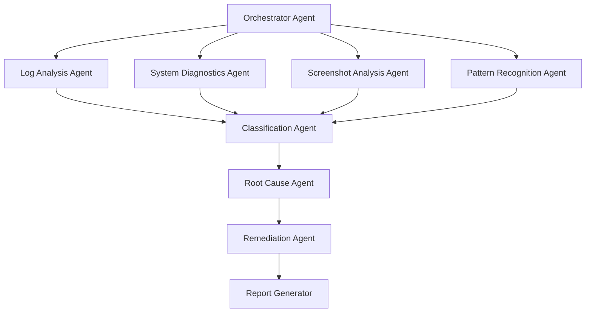

# Regression Analysis Agent - Part 2: Agent Development & Orchestration

*Continuation of the Regression Test Failure Analysis AI Agent Master Plan*

---

## Agent Development Framework

### Architecture: Multi-Agent System

We'll use a **multi-agent architecture** where specialized agents handle different aspects of analysis:



### Agent Definitions

#### 1. Orchestrator Agent

**Responsibility**: Main coordinator that routes tasks to specialized agents

```python
# orchestrator_agent.py
from typing import Dict, List, Any
from datetime import datetime
import asyncio

class OrchestratorAgent:
    """Main agent that orchestrates the entire analysis workflow"""
    
    def __init__(self, config: Dict):
        self.config = config
        self.log_analyzer = LogAnalysisAgent(config)
        self.system_diagnostics = SystemDiagnosticsAgent(config)
        self.screenshot_analyzer = ScreenshotAnalysisAgent(config)
        self.pattern_recognizer = PatternRecognitionAgent(config)
        self.classifier = ClassificationAgent(config)
        self.root_cause_analyzer = RootCauseAgent(config)
        self.remediator = RemediationAgent(config)
        self.reporter = ReportGenerator(config)
    
    async def analyze_test_run(self, run_data: Dict) -> Dict:
        """Orchestrate analysis of an entire test run"""
        
        analysis_id = f"analysis_{datetime.now().strftime('%Y%m%d_%H%M%S')}"
        print(f"Starting analysis: {analysis_id}")
        
        # Step 1: Parallel analysis of all data sources
        log_analysis_task = self.log_analyzer.analyze(run_data['test_logs'])
        system_analysis_task = self.system_diagnostics.analyze(run_data['system_logs'], run_data['metrics'])
        screenshot_analysis_task = self.screenshot_analyzer.analyze(run_data['screenshots'])
        
        # Wait for all analyses to complete
        log_results, system_results, screenshot_results = await asyncio.gather(
            log_analysis_task,
            system_analysis_task,
            screenshot_analysis_task
        )
        
        # Step 2: Pattern recognition across all failures
        pattern_results = await self.pattern_recognizer.find_patterns({
            'log_analysis': log_results,
            'system_analysis': system_results,
            'screenshot_analysis': screenshot_results
        })
        
        # Step 3: Classify each failure
        classification_results = await self.classifier.classify_failures({
            'log_analysis': log_results,
            'system_analysis': system_results,
            'screenshot_analysis': screenshot_results,
            'patterns': pattern_results
        })
        
        # Step 4: Deep dive root cause analysis for each failure
        root_cause_tasks = []
        for failure in classification_results['failures']:
            task = self.root_cause_analyzer.analyze_root_cause(
                failure,
                {
                    'log_analysis': log_results,
                    'system_analysis': system_results,
                    'screenshot_analysis': screenshot_results,
                    'patterns': pattern_results
                }
            )
            root_cause_tasks.append(task)
        
        root_cause_results = await asyncio.gather(*root_cause_tasks)
        
        # Step 5: Generate remediation plans
        remediation_tasks = []
        for idx, failure in enumerate(classification_results['failures']):
            task = self.remediator.create_remediation_plan(
                failure,
                root_cause_results[idx]
            )
            remediation_tasks.append(task)
        
        remediation_plans = await asyncio.gather(*remediation_tasks)
        
        # Step 6: Generate comprehensive report
        final_report = await self.reporter.generate_report({
            'analysis_id': analysis_id,
            'run_data': run_data,
            'log_analysis': log_results,
            'system_analysis': system_results,
            'screenshot_analysis': screenshot_results,
            'patterns': pattern_results,
            'classifications': classification_results,
            'root_causes': root_cause_results,
            'remediation_plans': remediation_plans
        })
        
        return final_report
    
    async def execute_remediations(self, remediation_plans: List[Dict]) -> Dict:
        """Execute automated remediations"""
        
        execution_results = []
        
        for plan in remediation_plans:
            if plan.get('can_auto_remediate', False):
                result = await self.remediator.execute_remediation(plan)
                execution_results.append(result)
            else:
                execution_results.append({
                    'plan_id': plan['id'],
                    'status': 'manual_intervention_required',
                    'reason': 'Cannot auto-remediate this type of issue'
                })
        
        return {
            'total_plans': len(remediation_plans),
            'auto_executed': sum(1 for r in execution_results if r['status'] == 'executed'),
            'manual_required': sum(1 for r in execution_results if r['status'] == 'manual_intervention_required'),
            'results': execution_results
        }
```

#### 2. Log Analysis Agent

**Responsibility**: Deep analysis of test execution logs

```python
# log_analysis_agent.py
from typing import Dict, List
import asyncio
from openai import AsyncOpenAI

class LogAnalysisAgent:
    """Specialized agent for analyzing test logs"""
    
    def __init__(self, config: Dict):
        self.config = config
        self.llm_client = AsyncOpenAI(api_key=config['openai_api_key'])
        self.model = config.get('log_analysis_model', 'gpt-4-turbo-preview')
    
    async def analyze(self, test_logs: List[Dict]) -> Dict:
        """Analyze all test logs"""
        
        # Process logs in parallel
        analysis_tasks = []
        for log in test_logs:
            task = self._analyze_single_log(log)
            analysis_tasks.append(task)
        
        results = await asyncio.gather(*analysis_tasks)
        
        # Aggregate results
        return {
            'total_tests': len(test_logs),
            'passed': sum(1 for r in results if r['result'] == 'PASS'),
            'failed': sum(1 for r in results if r['result'] == 'FAIL'),
            'detailed_analyses': results
        }
    
    async def _analyze_single_log(self, log_data: Dict) -> Dict:
        """Analyze a single test log"""
        
        # Extract key information
        test_name = log_data.get('test_name')
        execution_log = log_data.get('logs', {}).get('execution', {})
        error_log = log_data.get('logs', {}).get('error', {})
        
        # Build analysis prompt
        prompt = self._build_log_analysis_prompt(execution_log, error_log)
        
        # Call LLM for analysis
        response = await self.llm_client.chat.completions.create(
            model=self.model,
            messages=[
                {
                    "role": "system",
                    "content": """You are a test log analysis expert. Analyze the provided test logs and extract:
1. Test result (PASS/FAIL)
2. Key events timeline
3. All errors and warnings
4. Suspicious patterns
5. Preliminary failure indicators

Respond in JSON format."""
                },
                {
                    "role": "user",
                    "content": prompt
                }
            ],
            response_format={"type": "json_object"},
            temperature=0.1
        )
        
        analysis = response.choices[0].message.content
        
        import json
        return {
            'test_name': test_name,
            'analysis': json.loads(analysis),
            'raw_log_summary': execution_log.get('summary', {})
        }
    
    def _build_log_analysis_prompt(self, execution_log: Dict, error_log: Dict) -> str:
        """Build prompt for log analysis"""
        
        prompt_parts = []
        
        # Summary information
        if execution_log.get('summary'):
            summary = execution_log['summary']
            prompt_parts.append(f"Test Result: {summary.get('result', 'UNKNOWN')}")
            prompt_parts.append(f"Duration: {summary.get('duration_seconds', 0)} seconds")
            prompt_parts.append(f"Errors: {summary.get('error_count', 0)}")
            prompt_parts.append(f"Warnings: {summary.get('warning_count', 0)}")
        
        # Key events
        if execution_log.get('events'):
            prompt_parts.append("\n=== Execution Events ===")
            for event in execution_log['events'][:20]:  # Limit to avoid token overflow
                prompt_parts.append(f"[{event.get('timestamp')}] {event.get('type')}: {event.get('content')}")
        
        # Errors
        if error_log.get('errors'):
            prompt_parts.append("\n=== Errors ===")
            for error in error_log['errors'][:10]:
                prompt_parts.append(f"[{error.get('timestamp')}] {error.get('content')}")
        
        return '\n'.join(prompt_parts)
```

#### 3. System Diagnostics Agent

**Responsibility**: Analyze system logs and metrics to detect infrastructure issues

```python
# system_diagnostics_agent.py
from typing import Dict, List
import asyncio
from datetime import datetime

class SystemDiagnosticsAgent:
    """Analyzes system logs and metrics for infrastructure issues"""
    
    def __init__(self, config: Dict):
        self.config = config
        self.llm_client = AsyncOpenAI(api_key=config['openai_api_key'])
        self.model = config.get('system_diagnostics_model', 'gpt-4-turbo-preview')
    
    async def analyze(self, system_logs: List[Dict], metrics: List[Dict]) -> Dict:
        """Analyze system health during test execution"""
        
        # Analyze logs and metrics in parallel
        log_analysis_task = self._analyze_system_logs(system_logs)
        metrics_analysis_task = self._analyze_metrics(metrics)
        
        log_results, metrics_results = await asyncio.gather(
            log_analysis_task,
            metrics_analysis_task
        )
        
        # Correlate findings
        correlated_issues = self._correlate_issues(log_results, metrics_results)
        
        return {
            'system_log_analysis': log_results,
            'metrics_analysis': metrics_results,
            'correlated_issues': correlated_issues,
            'infrastructure_health': self._assess_infrastructure_health(log_results, metrics_results)
        }
    
    async def _analyze_system_logs(self, system_logs: List[Dict]) -> Dict:
        """Analyze Windows Event Logs and other system logs"""
        
        # Group by VM
        vm_logs = {}
        for log in system_logs:
            vm = log.get('vm', 'unknown')
            if vm not in vm_logs:
                vm_logs[vm] = []
            vm_logs[vm].append(log)
        
        # Analyze each VM
        vm_analyses = {}
        for vm, logs in vm_logs.items():
            vm_analyses[vm] = await self._analyze_vm_logs(vm, logs)
        
        return vm_analyses
    
    async def _analyze_vm_logs(self, vm_name: str, logs: List[Dict]) -> Dict:
        """Analyze logs from a single VM"""
        
        # Filter critical events
        critical_events = [
            log for log in logs 
            if log.get('level') in ['1', '2', '3']  # Error, Warning, Critical
        ]
        
        # Build prompt
        prompt = f"Analyze system events from VM: {vm_name}\n\n"
        prompt += "Critical Events:\n"
        for event in critical_events[:15]:
            prompt += f"- [{event['level']}] {event['source']}: {event['message']}\n"
        
        prompt += "\nIdentify any infrastructure issues, their severity, and potential impact on test execution."
        
        response = await self.llm_client.chat.completions.create(
            model=self.model,
            messages=[
                {
                    "role": "system",
                    "content": "You are a Windows system administrator expert. Analyze system events for infrastructure issues."
                },
                {
                    "role": "user",
                    "content": prompt
                }
            ],
            response_format={"type": "json_object"},
            temperature=0.1
        )
        
        import json
        return {
            'vm': vm_name,
            'total_events': len(logs),
            'critical_events': len(critical_events),
            'analysis': json.loads(response.choices[0].message.content)
        }
    
    async def _analyze_metrics(self, metrics: List[Dict]) -> Dict:
        """Analyze Prometheus metrics for anomalies"""
        
        anomalies = []
        
        for metric_data in metrics:
            metric_name = metric_data.get('metric_name')
            stats = metric_data.get('stats', {})
            values = metric_data.get('values', [])
            
            # Detect anomalies based on thresholds
            if 'cpu' in metric_name.lower():
                if stats.get('max', 0) > 90:  # CPU > 90%
                    anomalies.append({
                        'metric': metric_name,
                        'type': 'cpu_high',
                        'severity': 'high',
                        'max_value': stats['max'],
                        'description': f'CPU usage reached {stats["max"]:.1f}%'
                    })
            
            elif 'memory' in metric_name.lower() or 'mem' in metric_name.lower():
                if 'available' in metric_name.lower():
                    # Low memory available
                    if stats.get('min', float('inf')) < 1073741824:  # < 1GB
                        anomalies.append({
                            'metric': metric_name,
                            'type': 'memory_low',
                            'severity': 'high',
                            'min_value': stats['min'],
                            'description': f'Available memory dropped to {stats["min"] / 1073741824:.2f}GB'
                        })
            
            elif 'disk' in metric_name.lower():
                if 'io_time' in metric_name.lower():
                    if stats.get('avg', 0) > 80:  # High disk I/O
                        anomalies.append({
                            'metric': metric_name,
                            'type': 'disk_io_high',
                            'severity': 'medium',
                            'avg_value': stats['avg'],
                            'description': f'High disk I/O time: {stats["avg"]:.1f}%'
                        })
            
            elif 'network' in metric_name.lower():
                # Detect network drops or spikes
                if len(values) > 1:
                    network_variance = self._calculate_variance([v['value'] for v in values])
                    if network_variance > 1000000000:  # High variance in network traffic
                        anomalies.append({
                            'metric': metric_name,
                            'type': 'network_unstable',
                            'severity': 'medium',
                            'variance': network_variance,
                            'description': 'Network traffic shows high variance'
                        })
        
        return {
            'total_metrics_analyzed': len(metrics),
            'anomalies_detected': len(anomalies),
            'anomalies': anomalies
        }
    
    def _correlate_issues(self, log_results: Dict, metrics_results: Dict) -> List[Dict]:
        """Correlate system log issues with metric anomalies"""
        
        correlated = []
        
        # Example correlation: High CPU + Error events
        for vm, vm_analysis in log_results.items():
            vm_issues = vm_analysis.get('analysis', {}).get('issues', [])
            
            # Check if there are CPU anomalies
            cpu_anomalies = [
                a for a in metrics_results.get('anomalies', [])
                if a['type'] == 'cpu_high'
            ]
            
            if vm_issues and cpu_anomalies:
                correlated.append({
                    'vm': vm,
                    'correlation_type': 'high_cpu_with_errors',
                    'system_issues': vm_issues,
                    'metric_anomalies': cpu_anomalies,
                    'likely_cause': 'System resource exhaustion affecting test execution'
                })
        
        return correlated
    
    def _assess_infrastructure_health(self, log_results: Dict, metrics_results: Dict) -> str:
        """Assess overall infrastructure health"""
        
        total_anomalies = metrics_results.get('anomalies_detected', 0)
        total_critical_events = sum(
            vm.get('critical_events', 0) 
            for vm in log_results.values()
        )
        
        if total_anomalies == 0 and total_critical_events == 0:
            return 'HEALTHY'
        elif total_anomalies < 3 and total_critical_events < 5:
            return 'DEGRADED'
        else:
            return 'UNHEALTHY'
    
    def _calculate_variance(self, values: List[float]) -> float:
        """Calculate variance of a list of values"""
        if not values:
            return 0.0
        
        mean = sum(values) / len(values)
        variance = sum((x - mean) ** 2 for x in values) / len(values)
        return variance
```

#### 4. Screenshot Analysis Agent

**Responsibility**: Analyze screenshots to detect visual issues

```python
# screenshot_analysis_agent.py
from typing import Dict, List
import asyncio
from openai import AsyncOpenAI
import base64
from pathlib import Path

class ScreenshotAnalysisAgent:
    """Analyzes screenshots for visual issues"""
    
    def __init__(self, config: Dict):
        self.config = config
        self.llm_client = AsyncOpenAI(api_key=config['openai_api_key'])
        self.vision_model = config.get('vision_model', 'gpt-4-vision-preview')
    
    async def analyze(self, screenshots: List[Dict]) -> Dict:
        """Analyze all screenshots"""
        
        # Identify screenshots from failed tests
        failed_test_screenshots = [
            ss for ss in screenshots 
            if self._is_from_failed_test(ss)
        ]
        
        # Analyze screenshots in parallel (with rate limiting)
        analysis_tasks = []
        for screenshot in failed_test_screenshots:
            task = self._analyze_screenshot(screenshot)
            analysis_tasks.append(task)
        
        # Process in batches to avoid rate limits
        batch_size = 5
        all_results = []
        
        for i in range(0, len(analysis_tasks), batch_size):
            batch = analysis_tasks[i:i + batch_size]
            batch_results = await asyncio.gather(*batch)
            all_results.extend(batch_results)
            
            # Rate limiting: wait between batches
            if i + batch_size < len(analysis_tasks):
                await asyncio.sleep(1)
        
        # Categorize issues
        categorized_issues = self._categorize_visual_issues(all_results)
        
        return {
            'total_screenshots_analyzed': len(failed_test_screenshots),
            'issues_detected': sum(1 for r in all_results if r.get('has_issues', False)),
            'detailed_analyses': all_results,
            'categorized_issues': categorized_issues
        }
    
    async def _analyze_screenshot(self, screenshot: Dict) -> Dict:
        """Analyze a single screenshot using vision model"""
        
        filepath = screenshot.get('path')
        test_name = screenshot.get('test_name')
        
        # Encode image to base64
        image_base64 = self._encode_image(filepath)
        
        # Prepare vision API call
        prompt = """Analyze this screenshot from an automated test and identify any issues:

1. Is the screenshot blank or mostly empty?
2. Are there any UI elements that appear broken or incorrectly rendered?
3. Are there any error dialogs or messages visible?
4. Does the screen appear to be in an unexpected state?
5. Are there any system dialogs (RDP, Windows notifications) that might interfere with testing?

Respond in JSON format with:
- has_issues: boolean
- issue_type: blank_screen | ui_broken | error_dialog | unexpected_state | system_interference | none
- description: detailed description
- severity: high | medium | low
"""
        
        response = await self.llm_client.chat.completions.create(
            model=self.vision_model,
            messages=[
                {
                    "role": "user",
                    "content": [
                        {"type": "text", "text": prompt},
                        {
                            "type": "image_url",
                            "image_url": {
                                "url": f"data:image/png;base64,{image_base64}"
                            }
                        }
                    ]
                }
            ],
            max_tokens=500,
            temperature=0.1
        )
        
        import json
        analysis = json.loads(response.choices[0].message.content)
        
        return {
            'screenshot': filepath,
            'test_name': test_name,
            'timestamp': screenshot.get('timestamp'),
            'analysis': analysis
        }
    
    def _encode_image(self, image_path: str) -> str:
        """Encode image to base64"""
        with open(image_path, "rb") as image_file:
            return base64.b64encode(image_file.read()).decode('utf-8')
    
    def _is_from_failed_test(self, screenshot: Dict) -> bool:
        """Determine if screenshot is from a failed test"""
        # Implement logic based on your naming convention or metadata
        # For now, analyze all screenshots
        return True
    
    def _categorize_visual_issues(self, analyses: List[Dict]) -> Dict:
        """Categorize visual issues"""
        
        categories = {
            'blank_screen': [],
            'ui_broken': [],
            'error_dialog': [],
            'unexpected_state': [],
            'system_interference': [],
            'no_issues': []
        }
        
        for analysis in analyses:
            issue_type = analysis.get('analysis', {}).get('issue_type', 'none')
            if issue_type in categories:
                categories[issue_type].append(analysis)
            else:
                categories['no_issues'].append(analysis)
        
        return categories
```

#### 5. Classification Agent

**Responsibility**: Classify failures into categories

```python
# classification_agent.py
from typing import Dict, List
import asyncio
from openai import AsyncOpenAI

class ClassificationAgent:
    """Classifies test failures into categories"""
    
    def __init__(self, config: Dict):
        self.config = config
        self.llm_client = AsyncOpenAI(api_key=config['openai_api_key'])
        self.model = config.get('classification_model', config.get('fine_tuned_model'))
        self.use_rag = config.get('use_rag', False)
        
        if self.use_rag:
            from rag_system import RAGSystem
            self.rag_system = RAGSystem(
                config['openai_api_key'],
                config.get('chroma_db_path', './chroma_db')
            )
    
    async def classify_failures(self, analysis_data: Dict) -> Dict:
        """Classify all failures"""
        
        log_analysis = analysis_data['log_analysis']
        system_analysis = analysis_data['system_analysis']
        screenshot_analysis = analysis_data['screenshot_analysis']
        patterns = analysis_data['patterns']
        
        # Get failed tests
        failed_tests = [
            test for test in log_analysis['detailed_analyses']
            if test['analysis'].get('result') == 'FAIL'
        ]
        
        # Classify each failure
        classification_tasks = []
        for test in failed_tests:
            task = self._classify_single_failure(
                test,
                system_analysis,
                screenshot_analysis,
                patterns
            )
            classification_tasks.append(task)
        
        classifications = await asyncio.gather(*classification_tasks)
        
        # Aggregate by category
        by_category = {
            'product_bug': [],
            'infrastructure_issue': [],
            'test_setup_issue': []
        }
        
        for classification in classifications:
            category = classification.get('category', 'unknown')
            if category in by_category:
                by_category[category].append(classification)
        
        return {
            'total_failures': len(failed_tests),
            'failures': classifications,
            'by_category': by_category,
            'summary': {
                'product_bugs': len(by_category['product_bug']),
                'infrastructure_issues': len(by_category['infrastructure_issue']),
                'test_setup_issues': len(by_category['test_setup_issue'])
            }
        }
    
    async def _classify_single_failure(
        self,
        test_data: Dict,
        system_analysis: Dict,
        screenshot_analysis: Dict,
        patterns: Dict
    ) -> Dict:
        """Classify a single test failure"""
        
        test_name = test_data['test_name']
        
        # Build comprehensive context
        context = self._build_classification_context(
            test_data,
            system_analysis,
            screenshot_analysis,
            patterns
        )
        
        # If RAG is enabled, get similar examples
        if self.use_rag:
            rag_results = self.rag_system.analyze_failure(context, top_k=3)
            similar_examples = rag_results['similar_examples']
            
            # Enhance context with similar examples
            context += "\n\n=== Similar Past Failures ===\n"
            for idx, example in enumerate(similar_examples, 1):
                context += f"\nExample {idx}:\n{example}\n"
        
        # Classify using LLM
        response = await self.llm_client.chat.completions.create(
            model=self.model,
            messages=[
                {
                    "role": "system",
                    "content": """You are an expert test failure classifier. Classify the test failure into one of these categories:

1. **product_bug**: Real product defect or software bug
2. **infrastructure_issue**: Infrastructure/system problem (VM, network, RDP, etc.)
3. **test_setup_issue**: Test configuration or setup problem

Also identify the specific subcategory and provide a confidence score.

Respond in JSON format:
{
  "category": "product_bug | infrastructure_issue | test_setup_issue",
  "subcategory": "specific subcategory",
  "confidence": 0.0 to 1.0,
  "reasoning": "explanation"
}"""
                },
                {
                    "role": "user",
                    "content": context
                }
            ],
            response_format={"type": "json_object"},
            temperature=0.2
        )
        
        import json
        classification = json.loads(response.choices[0].message.content)
        
        classification['test_name'] = test_name
        
        return classification
    
    def _build_classification_context(
        self,
        test_data: Dict,
        system_analysis: Dict,
        screenshot_analysis: Dict,
        patterns: Dict
    ) -> str:
        """Build comprehensive context for classification"""
        
        context_parts = []
        
        # Test information
        test_name = test_data['test_name']
        test_analysis = test_data['analysis']
        
        context_parts.append(f"Test: {test_name}")
        context_parts.append(f"Result: {test_analysis.get('result', 'UNKNOWN')}")
        
        # Errors and warnings
        if test_analysis.get('errors'):
            context_parts.append("\nErrors:")
            for error in test_analysis['errors'][:5]:
                context_parts.append(f"  - {error}")
        
        if test_analysis.get('warnings'):
            context_parts.append("\nWarnings:")
            for warning in test_analysis['warnings'][:3]:
                context_parts.append(f"  - {warning}")
        
        # System issues
        infrastructure_health = system_analysis.get('infrastructure_health', 'UNKNOWN')
        context_parts.append(f"\nInfrastructure Health: {infrastructure_health}")
        
        if system_analysis.get('correlated_issues'):
            context_parts.append("\nCorrelated System Issues:")
            for issue in system_analysis['correlated_issues']:
                context_parts.append(f"  - {issue.get('likely_cause', 'Unknown')}")
        
        # Screenshot issues
        screenshot_issues = self._find_screenshot_issues(test_name, screenshot_analysis)
        if screenshot_issues:
            context_parts.append("\nScreenshot Analysis:")
            for issue in screenshot_issues:
                desc = issue.get('analysis', {}).get('description', 'N/A')
                context_parts.append(f"  - {desc}")
        
        # Patterns
        if patterns.get('similar_failures'):
            similar = patterns['similar_failures'].get(test_name, [])
            if similar:
                context_parts.append(f"\nThis test has failed {len(similar)} times recently")
        
        return '\n'.join(context_parts)
    
    def _find_screenshot_issues(self, test_name: str, screenshot_analysis: Dict) -> List[Dict]:
        """Find screenshot issues for a specific test"""
        
        issues = []
        for analysis in screenshot_analysis.get('detailed_analyses', []):
            if analysis.get('test_name') == test_name:
                if analysis.get('analysis', {}).get('has_issues', False):
                    issues.append(analysis)
        
        return issues
```

#### 6. Root Cause Agent

**Responsibility**: Deep dive analysis to find exact root cause

```python
# root_cause_agent.py
from typing import Dict
from openai import AsyncOpenAI

class RootCauseAgent:
    """Performs deep root cause analysis"""
    
    def __init__(self, config: Dict):
        self.config = config
        self.llm_client = AsyncOpenAI(api_key=config['openai_api_key'])
        self.model = config.get('root_cause_model', 'gpt-4-turbo-preview')
    
    async def analyze_root_cause(self, failure: Dict, all_data: Dict) -> Dict:
        """Perform deep root cause analysis"""
        
        test_name = failure['test_name']
        category = failure['category']
        
        # Build detailed context specific to the failure category
        if category == 'product_bug':
            context = self._build_product_bug_context(test_name, all_data)
            analysis_type = "product defect"
        elif category == 'infrastructure_issue':
            context = self._build_infra_issue_context(test_name, all_data)
            analysis_type = "infrastructure problem"
        else:  # test_setup_issue
            context = self._build_setup_issue_context(test_name, all_data)
            analysis_type = "test setup problem"
        
        # Perform deep analysis
        prompt = f"""Perform a detailed root cause analysis for this {analysis_type}.

{context}

Provide:
1. **Exact root cause**: Pinpoint the specific issue
2. **Evidence**: List all supporting evidence
3. **Timeline**: When did the issue occur and what led to it
4. **Impact**: What was affected
5. **Criticality**: How critical is this issue (critical/high/medium/low)

Respond in JSON format."""
        
        response = await self.llm_client.chat.completions.create(
            model=self.model,
            messages=[
                {
                    "role": "system",
                    "content": "You are an expert debugger and root cause analyst."
                },
                {
                    "role": "user",
                    "content": prompt
                }
            ],
            response_format={"type": "json_object"},
            temperature=0.1
        )
        
        import json
        root_cause_analysis = json.loads(response.choices[0].message.content)
        
        return {
            'test_name': test_name,
            'category': category,
            'root_cause': root_cause_analysis
        }
    
    def _build_product_bug_context(self, test_name: str, all_data: Dict) -> str:
        """Build context for product bug analysis"""
        
        # Get test log data
        test_data = self._find_test_data(test_name, all_data['log_analysis'])
        
        context = f"Test: {test_name}\n\n"
        context += "=== Test Execution Logs ===\n"
        
        if test_data:
            analysis = test_data.get('analysis', {})
            
            # Include error traces
            if analysis.get('errors'):
                context += "Errors:\n"
                for error in analysis['errors']:
                    context += f"  {error}\n"
            
            # Include stack traces if available
            if analysis.get('exceptions'):
                context += "\nExceptions/Stack Traces:\n"
                for exc in analysis['exceptions']:
                    context += f"  {exc}\n"
            
            # Include timeline
            if analysis.get('timeline'):
                context += "\nEvent Timeline:\n"
                for event in analysis['timeline']:
                    context += f"  [{event['time']}] {event['description']}\n"
        
        return context
    
    def _build_infra_issue_context(self, test_name: str, all_data: Dict) -> str:
        """Build context for infrastructure issue analysis"""
        
        test_data = self._find_test_data(test_name, all_data['log_analysis'])
        system_analysis = all_data['system_analysis']
        
        context = f"Test: {test_name}\n\n"
        
        # Get test execution time
        if test_data:
            test_time = test_data.get('analysis', {}).get('timestamp')
            context += f"Test Execution Time: {test_time}\n\n"
        
        # System health at that time
        context += "=== Infrastructure Status ===\n"
        context += f"Overall Health: {system_analysis.get('infrastructure_health', 'UNKNOWN')}\n\n"
        
        # Metric anomalies
        if system_analysis.get('metrics_analysis', {}).get('anomalies'):
            context += "Metric Anomalies:\n"
            for anomaly in system_analysis['metrics_analysis']['anomalies']:
                context += f"  - {anomaly['description']} (Severity: {anomaly['severity']})\n"
        
        # System events
        if system_analysis.get('system_log_analysis'):
            context += "\nCritical System Events:\n"
            for vm, vm_data in system_analysis['system_log_analysis'].items():
                if vm_data.get('critical_events', 0) > 0:
                    context += f"  VM {vm}: {vm_data['critical_events']} critical events\n"
                    if vm_data.get('analysis', {}).get('issues'):
                        for issue in vm_data['analysis']['issues']:
                            context += f"    - {issue}\n"
        
        # Correlated issues
        if system_analysis.get('correlated_issues'):
            context += "\nCorrelated Issues:\n"
            for issue in system_analysis['correlated_issues']:
                context += f"  - {issue.get('likely_cause', 'Unknown')}\n"
        
        return context
    
    def _build_setup_issue_context(self, test_name: str, all_data: Dict) -> str:
        """Build context for test setup issue analysis"""
        
        test_data = self._find_test_data(test_name, all_data['log_analysis'])
        
        context = f"Test: {test_name}\n\n"
        context += "=== Test Setup Information ===\n"
        
        if test_data:
            metadata = test_data.get('metadata', {})
            
            context += f"Test Type: {metadata.get('test_type', 'Unknown')}\n"
            context += f"Environment: {metadata.get('environment', 'Unknown')}\n"
            
            # Look for setup-related errors
            analysis = test_data.get('analysis', {})
            
            setup_keywords = ['workspace', 'golden', 'reference', 'configuration', 
                            'setup', 'precondition', 'environment']
            
            setup_related_errors = []
            for error in analysis.get('errors', []):
                if any(keyword in error.lower() for keyword in setup_keywords):
                    setup_related_errors.append(error)
            
            if setup_related_errors:
                context += "\nSetup-Related Errors:\n"
                for error in setup_related_errors:
                    context += f"  - {error}\n"
        
        return context
    
    def _find_test_data(self, test_name: str, log_analysis: Dict) -> Dict:
        """Find test data by name"""
        
        for test in log_analysis.get('detailed_analyses', []):
            if test['test_name'] == test_name:
                return test
        
        return {}
```

*Continued in Part 3...*
